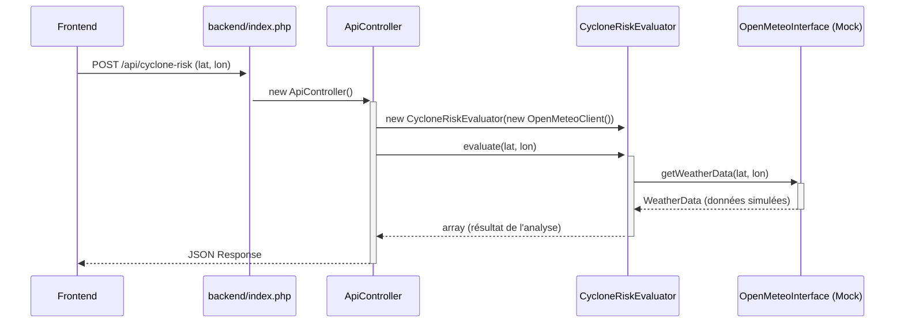

# Projet d'Analyseur de Risque Cyclonique

Ce projet est une application web légère permettant de détecter un risque cyclonique à partir de données météorologiques pour des coordonnées géographiques données. L'architecture est conçue pour être modulaire, découplée et prête pour une future intégration d'API réelle.

L'application est entièrement fonctionnelle avec un client API simulé (mock).

## 1. Arborescence du Projet

```
.
├── app/
│   ├── Controllers/
│   │   └── ApiController.php
│   ├── Models/
│   │   └── WeatherData.php
│   └── Services/
│       ├── CycloneRiskEvaluator.php
│       ├── OpenMeteoClient.php
│       └── OpenMeteoInterface.php
├── backend/
│   └── index.php
├── frontend/
│   ├── app.js
│   ├── index.html
│   └── style.css
├── tests/
│   ├── bootstrap.php
│   ├── CycloneRiskEvaluatorTest.php
│   └── OpenMeteoClientTest.php
├── composer.json
├── phpunit.xml
└── README.md
```

## 2. Description des Fichiers et Dossiers

- **`/app`**: Cœur de la logique applicative (backend).
    - **`/Controllers`**: Reçoit les requêtes HTTP et orchestre les réponses.
        - `ApiController.php`: Valide les requêtes du frontend, appelle les services et retourne les données en JSON.
    - **`/Models`**: Représente les structures de données.
        - `WeatherData.php`: Classe simple contenant les données météo (vitesse du vent, pression, etc.).
    - **`/Services`**: Contient la logique métier et les interactions avec des services externes.
        - `OpenMeteoInterface.php`: **Clé du découplage**. Définit un contrat pour tout client météo.
        - `OpenMeteoClient.php`: Implémentation **simulée** de l'interface. Ne fait aucun appel réseau et retourne des données en dur.
        - `CycloneRiskEvaluator.php`: Service qui utilise un `OpenMeteoInterface` pour évaluer le risque cyclonique.
- **`/backend`**: Point d'entrée du serveur.
    - `index.php`: Fait office de routeur. Il dirige les requêtes `/api/*` vers le contrôleur et sert les fichiers statiques du dossier `/frontend` pour toutes les autres requêtes.
- **`/frontend`**: Interface utilisateur.
    - `index.html`: Structure de la page.
    - `style.css`: Feuille de style.
    - `app.js`: Gère les interactions, envoie les requêtes AJAX au backend et affiche les résultats.
- **`/tests`**: Contient les tests unitaires.
    - `bootstrap.php`: Charge l'autoloader pour que PHPUnit trouve les classes de l'application.
    - `CycloneRiskEvaluatorTest.php`: Teste la logique de l'évaluateur en utilisant un mock de `OpenMeteoInterface`, prouvant que la logique est testable indépendamment de l'API.
    - `OpenMeteoClientTest.php`: Vérifie que le client API simulé est fonctionnel.
- `composer.json`: Définit les dépendances du projet (PHPUnit) et l'autoloader PSR-4.
- `phpunit.xml`: Fichier de configuration pour PHPUnit.

## 3. Découplage de l'API

Le découplage entre la logique métier et le client API est assuré par l'**injection de dépendances** et le **principe d'inversion de dépendances**.

1.  **Interface (`OpenMeteoInterface`)**: Elle définit un contrat (`getWeatherData(...)`) sans imposer de technologie.
2.  **Service (`CycloneRiskEvaluator`)**: Au lieu de dépendre directement de `OpenMeteoClient`, il dépend de l'abstraction `OpenMeteoInterface`. Il ignore totalement comment les données sont récupérées.
3.  **Injection (`ApiController`)**: C'est le contrôleur qui décide quelle implémentation concrète du client sera utilisée. Il "injecte" une instance de `OpenMeteoClient` (le mock) dans `CycloneRiskEvaluator`.

**Avantage majeur** : Pour passer à la vraie API, il suffira de modifier **une seule ligne** dans `ApiController.php` pour instancier le nouveau client réel. Les tests et la logique métier resteront inchangés.

## 4. Diagrammes de Flux

### Flux Interne du Backend



### Flux Backend <-> Frontend

```mermaid
graph TD
    A[Frontend (app.js)] -- "1. POST /api/cyclone-risk\n{lat, lon}" --> B{backend/index.php};
    B -- "2. Route vers ApiController" --> C[ApiController];
    C -- "3. Appelle le service d'évaluation" --> D[CycloneRiskEvaluator];
    D -- "4. Utilise le client mock" --> E[OpenMeteoClient (Mock)];
    E -- "5. Retourne des données factices" --> D;
    D -- "6. Analyse les données" --> C;
    C -- "7. Construit la réponse JSON" --> B;
    B -- "8. Renvoie le JSON au navigateur" --> A;
    A -- "9. Affiche le résultat" --> F[DOM (index.html)];
```

## 5. Conventions et Bonnes Pratiques

- **Nommage**:
    - Classes : `PascalCase` (ex: `CycloneRiskEvaluator`).
    - Méthodes : `camelCase` (ex: `handleCycloneRiskRequest`).
    - Variables : `camelCase`.
- **Standard de code**: PSR-12 est recommandé.
- **Dépendances**: Utiliser Composer pour gérer les dépendances PHP.
- **Sécurité**: Valider et nettoyer toutes les entrées utilisateur (fait dans `ApiController`). Ne jamais faire confiance aux données provenant du client.
- **Modularité**: Garder les responsabilités bien séparées (un contrôleur ne fait pas de calcul, un service ne gère pas de JSON HTTP).

## 6. Instructions pour Exécuter l'Application

**Prérequis**:
- PHP >= 8.0
- Composer (https://getcomposer.org/)

**Étapes**:

1.  **Installer les dépendances**
    Ouvrez un terminal à la racine du projet et exécutez :
    ```bash
    composer install
    ```
    Cette commande va télécharger PHPUnit et configurer l'autoloader.

2.  **Lancer le serveur de développement PHP**
    Toujours à la racine du projet, lancez le serveur web intégré de PHP en pointant vers le routeur `backend/index.php`:
    ```bash
    php -S localhost:8000 backend/index.php
    ```
    - `-S localhost:8000`: Démarre un serveur sur le port 8000.
    - `backend/index.php`: Utilise ce fichier comme routeur pour toutes les requêtes.

3.  **Accéder à l'application**
    Ouvrez votre navigateur et allez à l'adresse :
    [http://localhost:8000/](http://localhost:8000/)

    Vous devriez voir l'interface utilisateur. Pour tester les différents cas de risque simulés :
    - **Risque élevé**: Latitude `13.37`
    - **Risque faible**: Toute autre valeur

4.  **Lancer les tests unitaires**
    Pour vérifier que toute la logique fonctionne comme prévu, exécutez :
    ```bash
    composer test
    ```
    ou directement :
    ```bash
    vendor/bin/phpunit
    ```
    Les tests doivent tous passer, confirmant que l'architecture est saine et que les tests avec mock fonctionnent.