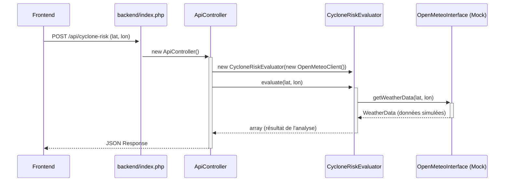

# Projet d'Analyseur de Risque Cyclonique

Ce projet est une application web légère permettant de détecter un risque cyclonique à partir de données météorologiques pour des coordonnées géographiques données. L'architecture est conçue pour être modulaire, découplée et prête pour une future intégration d'API réelle.

L'application est entièrement fonctionnelle avec un client API simulé (mock).

## 1. Arborescence du Projet

```
.
├── app/
│   ├── Controllers/
│   │   └── ApiController.php
│   ├── Models/
│   │   └── WeatherData.php
│   └── Services/
│       ├── CycloneRiskEvaluator.php
│       ├── OpenMeteoClient.php
│       └── OpenMeteoInterface.php
├── backend/
│   └── index.php
├── frontend/
│   ├── app.js
│   ├── index.html
│   └── style.css
├── tests/
│   ├── bootstrap.php
│   ├── CycloneRiskEvaluatorTest.php
│   └── OpenMeteoClientTest.php
├── composer.json
├── phpunit.xml
└── README.md
```

## 2. Description des Fichiers et Dossiers

- **`/app`**: Cœur de la logique applicative (backend).
    - **`/Controllers`**: Reçoit les requêtes HTTP et orchestre les réponses.
        - `ApiController.php`: Valide les requêtes du frontend, appelle les services et retourne les données en JSON.
    - **`/Models`**: Représente les structures de données.
        - `WeatherData.php`: Classe simple contenant les données météo (vitesse du vent, pression, etc.).
    - **`/Services`**: Contient la logique métier et les interactions avec des services externes.
        - `OpenMeteoInterface.php`: **Clé du découplage**. Définit un contrat pour tout client météo.
        - `OpenMeteoClient.php`: Implémentation **simulée** de l'interface. Ne fait aucun appel réseau et retourne des données en dur.
        - `CycloneRiskEvaluator.php`: Service qui utilise un `OpenMeteoInterface` pour évaluer le risque cyclonique.
- **`/backend`**: Point d'entrée du serveur.
    - `index.php`: Fait office de routeur. Il dirige les requêtes `/api/*` vers le contrôleur et sert les fichiers statiques du dossier `/frontend` pour toutes les autres requêtes.
- **`/frontend`**: Interface utilisateur.
    - `index.html`: Structure de la page.
    - `style.css`: Feuille de style.
    - `app.js`: Gère les interactions, envoie les requêtes AJAX au backend et affiche les résultats.
- **`/tests`**: Contient les tests unitaires.
    - `bootstrap.php`: Charge l'autoloader pour que PHPUnit trouve les classes de l'application.
    - `CycloneRiskEvaluatorTest.php`: Teste la logique de l'évaluateur en utilisant un mock de `OpenMeteoInterface`, prouvant que la logique est testable indépendamment de l'API.
    - `OpenMeteoClientTest.php`: Vérifie que le client API simulé est fonctionnel.
- `composer.json`: Définit les dépendances du projet (PHPUnit) et l'autoloader PSR-4.
- `phpunit.xml`: Fichier de configuration pour PHPUnit.

## 3. Découplage de l'API

Le découplage entre la logique métier et le client API est assuré par l'**injection de dépendances** et le **principe d'inversion de dépendances**.

1.  **Interface (`OpenMeteoInterface`)**: Elle définit un contrat (`getWeatherData(...)`) sans imposer de technologie.
2.  **Service (`CycloneRiskEvaluator`)**: Au lieu de dépendre directement de `OpenMeteoClient`, il dépend de l'abstraction `OpenMeteoInterface`. Il ignore totalement comment les données sont récupérées.
3.  **Injection (`ApiController`)**: C'est le contrôleur qui décide quelle implémentation concrète du client sera utilisée. Il "injecte" une instance de `OpenMeteoClient` (le mock) dans `CycloneRiskEvaluator`.

**Avantage majeur** : Pour passer à la vraie API, il suffira de modifier **une seule ligne** dans `ApiController.php` pour instancier le nouveau client réel. Les tests et la logique métier resteront inchangés.

## 4. Diagrammes de Flux

### Flux Interne du Backend



### Flux Backend <-> Frontend

```mermaid
graph TD
    A[Frontend (app.js)] -- "1. POST /api/cyclone-risk\n{lat, lon}" --> B{backend/index.php};
    B -- "2. Route vers ApiController" --> C[ApiController];
    C -- "3. Appelle le service d'évaluation" --> D[CycloneRiskEvaluator];
    D -- "4. Utilise le client mock" --> E[OpenMeteoClient (Mock)];
    E -- "5. Retourne des données factices" --> D;
    D -- "6. Analyse les données" --> C;
    C -- "7. Construit la réponse JSON" --> B;
    B -- "8. Renvoie le JSON au navigateur" --> A;
    A -- "9. Affiche le résultat" --> F[DOM (index.html)];
```

## 5. Conventions et Bonnes Pratiques

- **Nommage**:
    - Classes : `PascalCase` (ex: `CycloneRiskEvaluator`).
    - Méthodes : `camelCase` (ex: `handleCycloneRiskRequest`).
    - Variables : `camelCase`.
- **Standard de code**: PSR-12 est recommandé.
- **Dépendances**: Utiliser Composer pour gérer les dépendances PHP.
- **Sécurité**: Valider et nettoyer toutes les entrées utilisateur (fait dans `ApiController`). Ne jamais faire confiance aux données provenant du client.
- **Modularité**: Garder les responsabilités bien séparées (un contrôleur ne fait pas de calcul, un service ne gère pas de JSON HTTP).

## 6. Instructions pour Exécuter l'Application

**Prérequis**:
- PHP >= 8.0
- Composer (https://getcomposer.org/)

**Étapes**:

1.  **Installer les dépendances**
    Ouvrez un terminal à la racine du projet et exécutez :
    ```bash
    composer install
    ```
    Cette commande va télécharger PHPUnit et configurer l'autoloader.

2.  **Lancer le serveur de développement PHP**
    Toujours à la racine du projet, lancez le serveur web intégré de PHP en pointant vers le routeur `backend/index.php`:
    ```bash
    php -S localhost:8000 backend/index.php
    ```
    - `-S localhost:8000`: Démarre un serveur sur le port 8000.
    - `backend/index.php`: Utilise ce fichier comme routeur pour toutes les requêtes.

3.  **Accéder à l'application**
    Ouvrez votre navigateur et allez à l'adresse :
    [http://localhost:8000/](http://localhost:8000/)

    Vous devriez voir l'interface utilisateur. Pour tester les différents cas de risque simulés :
    - **Risque élevé**: Latitude `13.37`
    - **Risque faible**: Toute autre valeur

4.  **Lancer les tests unitaires**
    Pour vérifier que toute la logique fonctionne comme prévu, exécutez :
    ```bash
    composer test
    ```
    ou directement :
    ```bash
    vendor/bin/phpunit
    ```
    Les tests doivent tous passer, confirmant que l'architecture est saine et que les tests avec mock fonctionnent.


--------------------------------------------------------------------------------------------------------------------------------

 Explication du Fonctionnement Global

  Pour augmenter la robustesse de l'application, trois nouvelles composantes ont été ajoutées sans altérer l'architecture de base : un système
  de configuration, un service de logs, et la gestion des timeouts.

   1. Système de Configuration (`config.php` & `app/Config.php`)
       * Un fichier config.php a été ajouté à la racine du projet. Il contient toutes les valeurs de configuration (timeouts, paramètres de
         logs, etc.) dans un simple tableau PHP. Il est facile à modifier.
       * Une classe statique App\Config a été créée pour lire ces valeurs. Elle charge le fichier une seule fois et permet un accès simple et
         performant depuis n'importe où dans le code via Config::get('MA_CLE').

   2. Système de Logs (`app/Services/Logger.php`)
       * Une classe Logger a été créée. Lorsqu'elle est instanciée, elle lit la configuration pour savoir si les logs sont activés et où se    
         trouve le fichier de log (/logs/app.log par défaut).
       * Elle expose trois méthodes simples : info(), warning(), et error().
       * Chaque message est automatiquement préfixé par la date, l'heure et le niveau de log, assurant une traçabilité claire des événements.  
         Si les logs sont désactivés dans config.php, aucune écriture n'est effectuée.

   3. Intégration dans l'Application
       * `OpenMeteoClient` a été mis à jour pour utiliser ces deux systèmes. Avant chaque appel cURL, il log l'URL contactée. Après l'appel, il
         log le temps de réponse. Toutes les erreurs (timeout, JSON invalide, etc.) sont désormais logguées avec le niveau ERROR. Les timeouts
         de connexion et de requête totale sont lus depuis config.php et appliqués à cURL. La vérification SSL est également devenue
         configurable, ce qui résout le problème précédent de manière plus propre.
       * `ApiController` a aussi été enrichi. Il instancie le Logger pour tracer chaque requête entrante avec ses coordonnées. Si une erreur
         survient (une exception est attrapée), elle est logguée avant de renvoyer une réponse au client. Le résultat final de l'évaluation est
         également tracé.

  Instructions de Configuration et de Test

  1. Modifier la Configuration

  Ouvrez le fichier config.php à la racine du projet. Vous pouvez y modifier :

   * Activer/Désactiver les logs :
      Passez LOG_ENABLED à false pour désactiver complètement l'écriture des logs.

   1     'LOG_ENABLED' => false,

   * Changer le fichier de log :
      Modifiez la valeur de LOG_FILEPATH si vous souhaitez un autre emplacement.

   1     'LOG_FILEPATH' => __DIR__ . '/logs/mon_autre_fichier.log',

   * Modifier les timeouts :
      Ajustez API_TIMEOUT_CONNECT (pour établir la connexion) et API_TIMEOUT_TOTAL (pour toute la durée de la requête) en fonction de vos
  besoins. Les valeurs sont en secondes.

   1     'API_TIMEOUT_CONNECT' => 2,
   2     'API_TIMEOUT_TOTAL' => 5,

  2. Consulter les Logs

  Quand l'application est utilisée, ouvrez le fichier /logs/app.log pour voir les traces d'exécution en temps réel. C'est très utile pour le
  débogage.

  3. Exécuter les Nouveaux Tests

  Les tests unitaires ont été mis à jour et complétés. Pour vérifier que les nouveaux systèmes fonctionnent correctement, exécutez la commande
  suivante depuis la racine du projet :

   1 composer test

  Cette commande va maintenant aussi :
   * Vérifier que la classe Config lit correctement les valeurs.
   * Tester que le Logger écrit bien les messages formatés dans un fichier temporaire.

  L'application est désormais plus stable, plus facile à déboguer et plus configurable, tout en respectant l'architecture initiale.